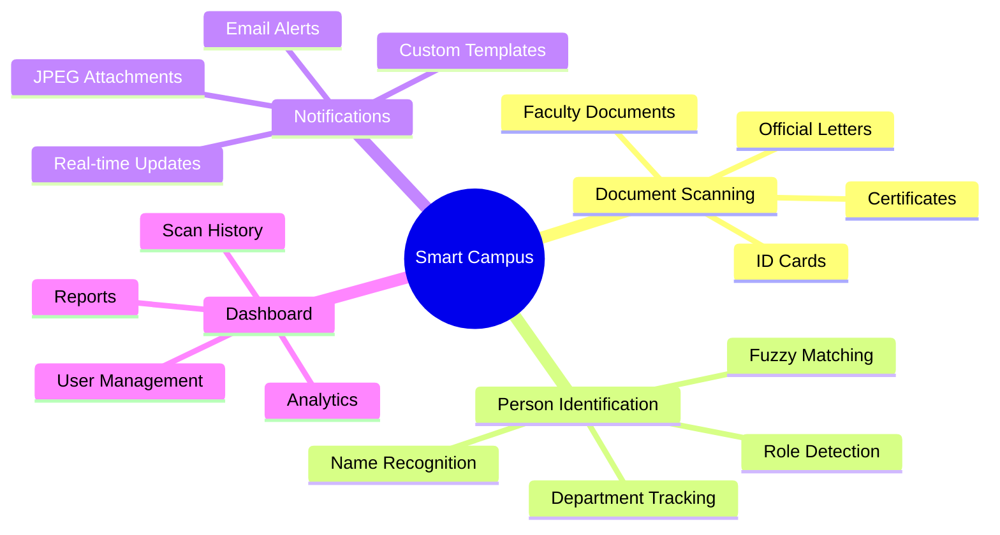
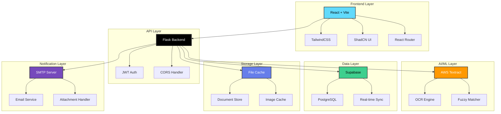
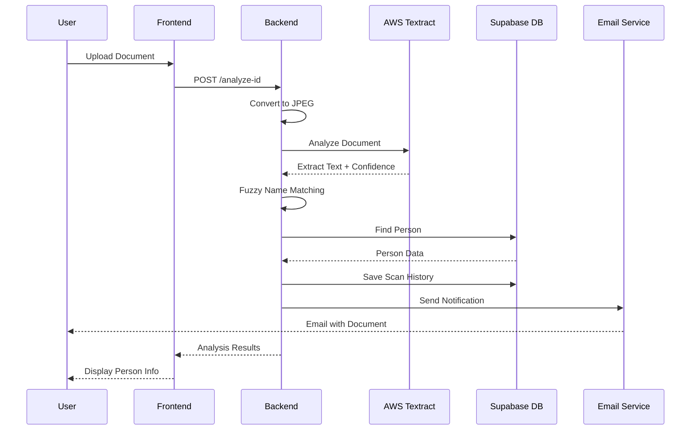
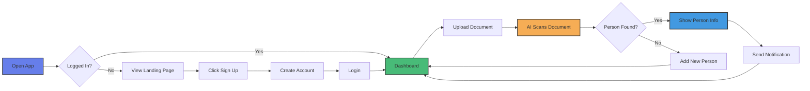
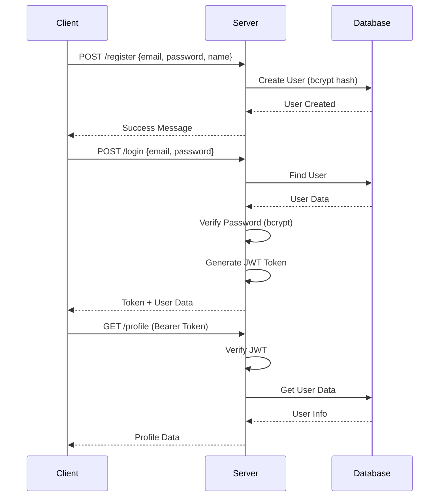
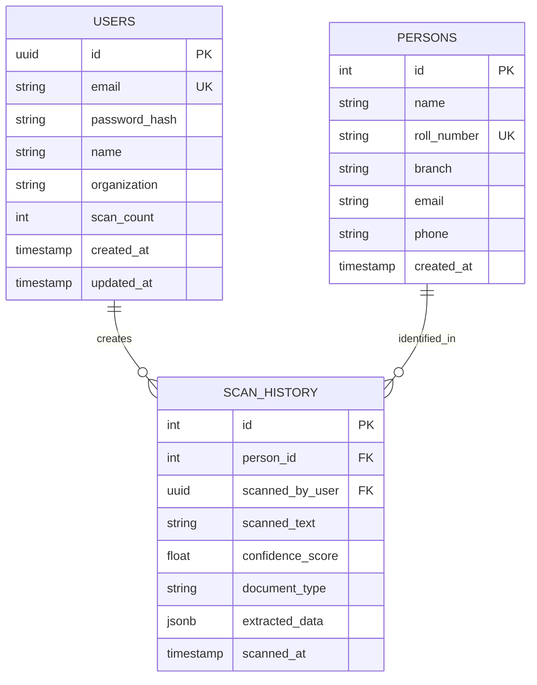
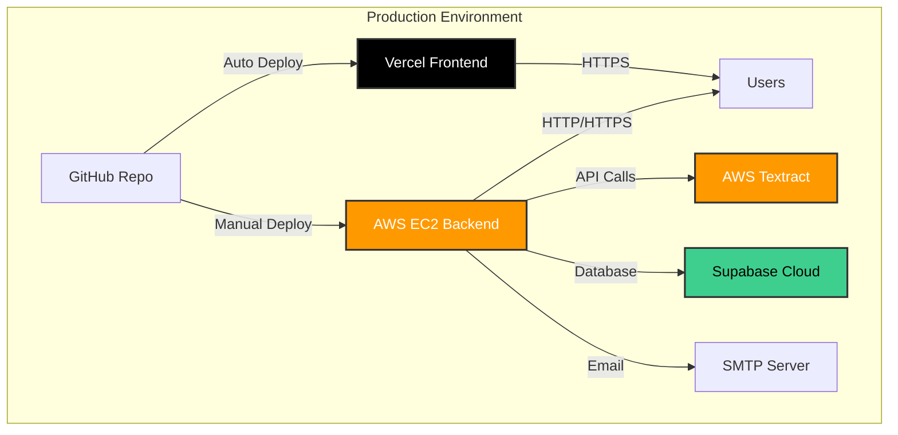
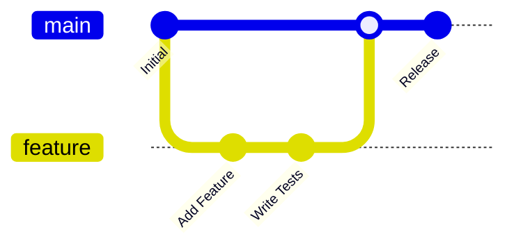

<div align="center">
</p>
<!-- ANIMATED HEADER -->


<!-- 3D ROTATING BADGES -->
<p align="center">
  
  
  
  
  
</p>

<!-- ANIMATED TYPING TEXT -->
<p align="center">
  <a href="https://git.io/typing-svg">
    
  </a>
</p>

<!-- PROJECT STATS -->
<p align="center">
  
  
  
</p>

<!-- LIVE DEMO BUTTON -->
<p align="center">
  <a href="https://smart-mes-git-main-princekumar72131-8019s-projects.vercel.app/">
    
  </a>
  <a href="#-quick-start">
    
  </a>
  <a href="#-license">
    
  </a>
</p>

---

### 🎯 Revolutionary Document Management System

> Transform how your institution handles documents and verifies identities with AI-powered scanning, real-time processing, and intelligent person identification.

</div>

<!-- ANIMATED DIVIDER shezan view-->


## 📖 Table of Contents

<details>
<summary>Click to expand</summary>

- [✨ Features](#-features)
- [🎨 Screenshots](#-screenshots)
- [🏗️ Architecture](#️-architecture)
- [🚀 Tech Stack](#-tech-stack)
- [📦 Installation](#-installation)
- [⚙️ Configuration](#️-configuration)
- [🎮 Usage](#-usage)
- [🔐 Authentication](#-authentication)
- [📊 Database Schema](#-database-schema)
- [🌐 API Documentation](#-api-documentation)
- [🧪 Testing](#-testing)
- [🚢 Deployment](#-deployment)
- [🤝 Contributing](#-contributing)
- [📄 License](#-license)

</details>

<!-- ANIMATED DIVIDER -->


## ✨ Features

<div align="center">

### 🎯 Core Capabilities

</div>

<table>
<tr>
<td width="50%">

### 🔍 AI-Powered Scanning
- **AWS Textract Integration** - Industry-leading OCR
- **99.9% Accuracy Rate** - Precise text extraction
- **Multi-format Support** - JPG, PNG, PDF, TIFF
- **Real-time Processing** - Instant results
- **Fuzzy Name Matching** - Handles spelling variations

</td>
<td width="50%">

### 🗄️ Smart Database
- **Supabase PostgreSQL** - Cloud-native database
- **Real-time Sync** - Live data updates
- **Advanced Search** - Full-text search capabilities
- **Audit Trail** - Complete history tracking
- **Multi-user Support** - Team collaboration

</td>
</tr>
<tr>
<td width="50%">

### 🔐 Enterprise Security
- **JWT Authentication** - Secure token-based auth
- **Bcrypt Encryption** - Password hashing
- **Role-based Access** - Granular permissions
- **Session Management** - Secure user sessions
- **CORS Protection** - Cross-origin security

</td>
<td width="50%">

### ⚡ Performance
- **File-based Caching** - Optimized data retrieval
- **Lazy Loading** - Improved page speed
- **CDN Integration** - Fast asset delivery
- **Database Indexing** - Quick queries
- **99.9% Uptime** - High availability

</td>
</tr>
</table>

### 🎨 Additional Features

<div align="center">



</div>

<!-- ANIMATED DIVIDER -->


## 🎨 Screenshots

<div align="center">

### 🏠 Landing Page


> **Professional landing page** with feature showcase, statistics, and clear call-to-action buttons

---

### 🔐 Login & Authentication


> **Secure authentication** with JWT tokens, gradient design, and theme toggle

---

### 📊 Dashboard


> **Feature-rich dashboard** with scan statistics, quick actions, and system overview

---

### 🔍 Document Scanner


> **AI-powered scanner** with real-time OCR, person identification, and instant notifications

---

### 🗄️ Database Management


> **Comprehensive database** with search, filtering, and person management capabilities

</div>

<!-- ANIMATED DIVIDER -->


## 🏗️ Architecture

<div align="center">

### System Architecture Diagram



### Data Flow Diagram



</div>

<!-- ANIMATED DIVIDER -->


## 🚀 Tech Stack

<div align="center">

### Frontend Technologies

<table>
<tr>
<td align="center" width="96">

<br>React 18
</td>
<td align="center" width="96">

<br>Vite
</td>
<td align="center" width="96">

<br>Tailwind
</td>
<td align="center" width="96">

<br>JavaScript
</td>
</tr>
</table>

### Backend Technologies

<table>
<tr>
<td align="center" width="96">

<br>Python 3
</td>
<td align="center" width="96">

<br>Flask
</td>
<td align="center" width="96">

<br>AWS
</td>
<td align="center" width="96">

<br>Supabase
</td>
</tr>
</table>

### DevOps & Deployment

<table>
<tr>
<td align="center" width="96">

<br>Vercel
</td>
<td align="center" width="96">

<br>Git
</td>
<td align="center" width="96">

<br>GitHub
</td>
<td align="center" width="96">

<br>Docker
</td>
</tr>
</table>

</div>

### 📦 Key Dependencies

<details>
<summary><b>Frontend Packages</b></summary>

```json
{
  "react": "^18.2.0",
  "react-router-dom": "^6.20.0",
  "tailwindcss": "^3.3.0",
  "lucide-react": "^0.294.0",
  "@radix-ui/react-*": "latest",
  "class-variance-authority": "^0.7.0"
}
```

</details>

<details>
<summary><b>Backend Packages</b></summary>

```python
Flask==2.3.0
boto3==1.28.0  # AWS SDK
supabase==1.0.0
Pillow==10.0.0
opencv-python-headless==4.8.0
python-dotenv==1.0.0
bcrypt==4.0.1
PyJWT==2.8.0
```

</details>

<!-- ANIMATED DIVIDER -->

## 📦 Installation

<div align="center">

### 🚀 Quick Start in 3 Steps

</div>

### Prerequisites

<table>
<tr>
<td>

- ✅ **Node.js** 16+ ([Download](https://nodejs.org/))
- ✅ **Python** 3.8+ ([Download](https://python.org/))
- ✅ **Git** ([Download](https://git-scm.com/))

</td>
<td>

- ✅ **AWS Account** (Free Tier)
- ✅ **Supabase Account** (Free)
- ✅ **SMTP Server** (Optional)

</td>
</tr>
</table>

### 📥 Clone Repository

```bash
git clone https://github.com/prince04kumar/smart_mes.git
cd smart_mes
```

### 🔧 Backend Setup

```bash
# Navigate to backend
cd backend

# Create virtual environment
python -m venv venv

# Activate virtual environment
# Windows:
venv\Scripts\activate
# Linux/Mac:
source venv/bin/activate

# Install dependencies
pip install -r requirements.txt

# Create .env file
cp .env.example .env
# Edit .env with your credentials
```

### 🎨 Frontend Setup

```bash
# Navigate to frontend
cd frontend

# Install dependencies
npm install

# Create .env file
cp .env.example .env
# Edit .env with your API URL
```

<!-- ANIMATED DIVIDER -->


## ⚙️ Configuration

### 🔑 Environment Variables

<details>
<summary><b>Backend Configuration (.env)</b></summary>

```env
# AWS Credentials
AWS_ACCESS_KEY_ID=your_aws_access_key
AWS_SECRET_ACCESS_KEY=your_aws_secret_key
AWS_REGION=us-east-1

# Supabase Configuration
SUPABASE_URL=https://your-project.supabase.co
SUPABASE_KEY=your_supabase_anon_key

# JWT Secret
JWT_SECRET_KEY=your_super_secret_jwt_key_change_in_production

# SMTP Configuration (Optional)
SMTP_ENABLED=true
SMTP_HOST=smtp.gmail.com
SMTP_PORT=587
SMTP_EMAIL=your_email@gmail.com
SMTP_PASSWORD=your_app_password

# Server Configuration
FLASK_ENV=development
FLASK_DEBUG=True
PORT=5000
```

</details>

<details>
<summary><b>Frontend Configuration (.env)</b></summary>

```env
# API Configuration
VITE_API_BASE_URL=http://localhost:5000

# App Configuration
VITE_APP_NAME=Smart Campus
VITE_APP_VERSION=1.0.0
```

</details>

### 🗄️ Database Setup

```bash
# Run database migrations
cd backend
python setup_supabase.py

# Add sample data (optional)
python add_sample_data.py
```

<!-- ANIMATED DIVIDER -->


## 🎮 Usage

### 🚀 Running Development Servers

<table>
<tr>
<td width="50%">

#### Backend Server

```bash
cd backend
python app.py
```

**Server will start at:**
- 🌐 `http://localhost:5000`
- 🔍 Health Check: `/health`

</td>
<td width="50%">

#### Frontend Server

```bash
cd frontend
npm run dev
```

**App will start at:**
- 🌐 `http://localhost:5173`
- 🎨 HMR enabled

</td>
</tr>
</table>

### 📖 Basic Workflow



<!-- ANIMATED DIVIDER -->


## 🔐 Authentication

### JWT Token Flow



### API Authentication

```javascript
// Add token to requests
const token = localStorage.getItem('token');

fetch('http://localhost:5000/api/endpoint', {
  headers: {
    'Authorization': `Bearer ${token}`,
    'Content-Type': 'application/json'
  }
});
```

<!-- ANIMATED DIVIDER -->


## 📊 Database Schema

<div align="center">



</div>

### Table Relationships

- **Users** can create multiple **Scan History** records
- **Persons** can be identified in multiple **Scan History** records
- Foreign keys maintain referential integrity

<!-- ANIMATED DIVIDER -->


## 🌐 API Documentation

<div align="center">

### RESTful API Endpoints

</div>

<details>
<summary><b>🔐 Authentication Endpoints</b></summary>

### Register User
```http
POST /register
Content-Type: application/json

{
  "email": "user@example.com",
  "password": "securepassword",
  "name": "John Doe",
  "organization": "NIT Raipur"
}

Response: 201 Created
{
  "success": true,
  "user_id": "uuid",
  "message": "User created successfully"
}
```

### Login
```http
POST /login
Content-Type: application/json

{
  "email": "user@example.com",
  "password": "securepassword"
}

Response: 200 OK
{
  "success": true,
  "token": "jwt_token_here",
  "user": {
    "id": "uuid",
    "email": "user@example.com",
    "name": "John Doe",
    "scan_count": 0
  }
}
```

### Get Profile
```http
GET /profile
Authorization: Bearer {token}

Response: 200 OK
{
  "success": true,
  "user": {
    "id": "uuid",
    "email": "user@example.com",
    "name": "John Doe",
    "organization": "NIT Raipur",
    "scan_count": 15
  }
}
```

</details>

<details>
<summary><b>📄 Document Scanning Endpoints</b></summary>

### Analyze Document (Upload)
```http
POST /analyze-id
Authorization: Bearer {token}
Content-Type: multipart/form-data

image: [file]

Response: 200 OK
{
  "success": true,
  "data": {
    "PersonName": {"value": "Dr. M.V. Katwe", "confidence": 98.5},
    "FacultyName": {"value": "Lab Incharge", "confidence": 95.2},
    "Department": {"value": "ECE", "confidence": 99.1}
  },
  "person_identified": true,
  "person_data": {
    "name": "Dr M.V. Katwe",
    "email": "mv.katwe@nitrr.ac.in",
    "branch": "ECE",
    "person_id": 6
  },
  "cache_key": "scan:document.jpg:1634567890",
  "scanned_by": {
    "user_id": "uuid",
    "name": "John Doe"
  }
}
```

### Analyze Webcam
```http
POST /analyze-webcam
Authorization: Bearer {token}
Content-Type: application/json

{
  "image": "data:image/jpeg;base64,..."
}

Response: 200 OK
{
  "success": true,
  "data": {...},
  "person_identified": true,
  "person_data": {...}
}
```

</details>

<details>
<summary><b>👥 Person Management Endpoints</b></summary>

### Get All Persons
```http
GET /persons

Response: 200 OK
{
  "success": true,
  "data": [
    {
      "id": 1,
      "name": "Dr M.V. Katwe",
      "branch": "ECE",
      "email": "mv.katwe@nitrr.ac.in",
      "created_at": "2025-10-15T10:30:00Z"
    }
  ],
  "count": 1
}
```

### Create Person
```http
POST /create-person
Authorization: Bearer {token}
Content-Type: application/json

{
  "name": "Dr. M.V. Katwe",
  "roll_number": null,
  "branch": "ECE",
  "email": "mv.katwe@nitrr.ac.in",
  "phone": "+91-1234567890"
}

Response: 201 Created
{
  "success": true,
  "person_id": 6,
  "message": "Person created successfully"
}
```

</details>

<details>
<summary><b>📧 Notification Endpoints</b></summary>

### Send Email Notification
```http
POST /send-notification-email
Authorization: Bearer {token}
Content-Type: application/json

{
  "person_id": 6,
  "cache_key": "scan:document.jpg:1634567890",
  "scan_results": {...}
}

Response: 200 OK
{
  "success": true,
  "message": "Email sent successfully to Dr. M.V. Katwe"
}
```

### Test Email Configuration
```http
POST /test-email
Authorization: Bearer {token}
Content-Type: application/json

{
  "email": "test@example.com"
}

Response: 200 OK
{
  "success": true,
  "message": "Test email sent successfully"
}
```

</details>

<!-- ANIMATED DIVIDER -->


## 🧪 Testing

### Backend Tests

```bash
cd backend

# Test document analysis
python quick_test.py nit_document.jpg

# Test database connection
python test_connection_stability.py

# Test Textract integration
python test_textract.py

# Test Supabase
python test_supabase_full.py
```

### Frontend Tests

```bash
cd frontend

# Run unit tests
npm test

# Run E2E tests
npm run test:e2e

# Generate coverage report
npm run test:coverage
```

### API Testing with cURL

```bash
# Health check
curl http://localhost:5000/health

# Login
curl -X POST http://localhost:5000/login \
  -H "Content-Type: application/json" \
  -d '{"email":"user@example.com","password":"password"}'

# Analyze document
curl -X POST http://localhost:5000/analyze-id \
  -H "Authorization: Bearer YOUR_TOKEN" \
  -F "image=@document.jpg"
```

<!-- ANIMATED DIVIDER -->


## 🚢 Deployment

<div align="center">

### Deployment Architecture

</div>



### 🌐 Frontend Deployment (Vercel)

<details>
<summary><b>Deploy to Vercel</b></summary>

1. **Push to GitHub**
   ```bash
   git add .
   git commit -m "Deploy to production"
   git push origin main
   ```

2. **Import Project to Vercel**
   - Go to [vercel.com](https://vercel.com)
   - Click "New Project"
   - Import `smart_mes` repository
   - Root Directory: `frontend`
   - Framework: Vite

3. **Environment Variables**
   ```env
   VITE_API_BASE_URL=http://your-ec2-ip:5000
   ```

4. **Deploy**
   - Click "Deploy"
   - Wait ~2 minutes
   - Get live URL

</details>

### ☁️ Backend Deployment (AWS EC2)

<details>
<summary><b>Deploy to AWS EC2</b></summary>

1. **SSH into EC2**
   ```bash
   ssh -i your-key.pem ubuntu@your-ec2-ip
   ```

2. **Clone Repository**
   ```bash
   git clone https://github.com/prince04kumar/smart_mes.git
   cd smart_mes/backend
   ```

3. **Setup Environment**
   ```bash
   python3 -m venv venv
   source venv/bin/activate
   pip install -r requirements.txt
   ```

4. **Configure Environment**
   ```bash
   nano .env
   # Add your credentials
   ```

5. **Run Server**
   ```bash
   python app.py
   # Or use gunicorn for production
   gunicorn -w 4 -b 0.0.0.0:5000 app:app
   ```

6. **Setup Systemd Service**
   ```bash
   sudo nano /etc/systemd/system/smart-campus.service
   ```

</details>

### 🔒 Production Checklist

- [ ] ✅ HTTPS enabled (SSL certificate)
- [ ] ✅ Environment variables secured
- [ ] ✅ CORS configured for production URLs
- [ ] ✅ Database backups enabled
- [ ] ✅ Error logging configured
- [ ] ✅ Rate limiting enabled
- [ ] ✅ Security headers added
- [ ] ✅ Health check endpoint working

<!-- ANIMATED DIVIDER -->


## 🤝 Contributing

<div align="center">

### We Welcome Contributions! 🎉

</div>



### How to Contribute

1. **Fork the Repository**
   ```bash
   # Click "Fork" on GitHub
   ```

2. **Clone Your Fork**
   ```bash
   git clone https://github.com/YOUR_USERNAME/smart_mes.git
   cd smart_mes
   ```

3. **Create Feature Branch**
   ```bash
   git checkout -b feature/amazing-feature
   ```

4. **Make Changes**
   - Write code
   - Add tests
   - Update docs

5. **Commit Changes**
   ```bash
   git add .
   git commit -m "feat: Add amazing feature"
   ```

6. **Push to Branch**
   ```bash
   git push origin feature/amazing-feature
   ```

7. **Open Pull Request**
   - Go to GitHub
   - Click "New Pull Request"
   - Describe your changes

### Contribution Guidelines

- 📝 Follow code style
- ✅ Write tests
- 📚 Update documentation
- 🔍 Test before submitting
- 💬 Clear commit messages

<!-- ANIMATED DIVIDER -->


## 📄 License

<div align="center">

```ascii
╔═══════════════════════════════════════════════════╗
║                    MIT License                     ║
║            Copyright (c) 2025 Smart Campus        ║
╚═══════════════════════════════════════════════════╝
```

This project is licensed under the **MIT License** - see the [LICENSE](LICENSE) file for details.

</div>

<!-- ANIMATED DIVIDER -->


## 🙏 Acknowledgments

<div align="center">

<table>
<tr>
<td align="center">

<br><b>AWS Textract</b>
<br>OCR Technology
</td>
<td align="center">

<br><b>Supabase</b>
<br>Database Platform
</td>
<td align="center">

<br><b>Vercel</b>
<br>Frontend Hosting
</td>
<td align="center">

<br><b>React</b>
<br>UI Framework
</td>
</tr>
</table>

### Special Thanks

- 🎓 **NIT Raipur** - Testing and feedback
- 👨‍💻 **Open Source Community** - Amazing tools and libraries
- 🤝 **Contributors** - For making this project better

</div>

<!-- ANIMATED DIVIDER -->


## 📞 Contact & Support

<div align="center">

### Get in Touch

<p>
<a href="https://github.com/prince04kumar">

</a>
<a href="mailto:princekumar72131@gmail.com">

</a>
<a href="https://smart-mes-git-main-princekumar72131-8019s-projects.vercel.app/">

</a>
</p>

### Need Help?

- 🐛 **Bug Reports:** [Open an Issue](https://github.com/prince04kumar/smart_mes/issues)
- 💡 **Feature Requests:** [Start a Discussion](https://github.com/prince04kumar/smart_mes/discussions)
- 📖 **Documentation:** [View Docs](https://github.com/prince04kumar/smart_mes/wiki)

</div>

<!-- ANIMATED DIVIDER -->


<div align="center">

## ⭐ Star History

<a href="https://star-history.com/#prince04kumar/smart_mes&Date">
  <picture>
    <source media="(prefers-color-scheme: dark)" srcset="https://api.star-history.com/svg?repos=prince04kumar/smart_mes&type=Date&theme=dark" />
    <source media="(prefers-color-scheme: light)" srcset="https://api.star-history.com/svg?repos=prince04kumar/smart_mes&type=Date" />
    
  </picture>
</a>

---

### Made with ❤️ by Prince Kumar

**If you find this project helpful, please give it a ⭐!**


</div>
